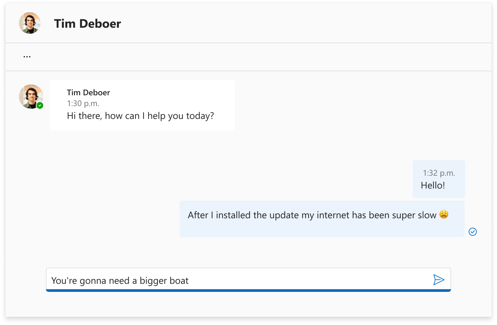

# mgt-chat

## Overview

The chat component enables the user to have 1:1 or group conversations. This component doesn't support channel conversations. The component allows for rendering conversations and authoring new messages. All data is stored in Microsoft Teams.

## User scenarios

### Priority 0

- [Rendering 1:1 conversations](#000)
- [Rendering group conversations](#001)
- [Sending textual messages from the component](#002)
- [Receiving real-time messages from Teams](#003)
- [Ensuring all system messages are rendered in the component](#004)
- [Ensuring DLP policies are respected in the component](#005)
- [Managing the roster of a group conversation](#006)
- [Managing the title of the conversation (when a group conversation)](#007)
- [Navigating to Microsoft Teams from the component](#008)
- [Rendering the most used content types in the component (rich text, emojis, images, GIFs, mentions, links, adaptive cards)](#009)
- [Rendering an unsupported card in the component when the component doesn't know about the content type](#010)
- [Displaying avatars, presence and cards from the users sending messages](#011)
- [Enabling multiple chat threads in the same page](#012)

### Priority 1

- Supporting custom themes to match the host application
- Displaying large status messages to users when something goes wrong
- Allowing users to mention members of the conversation
- Improve performance of the Graph calls by leveraging premium APIs
- Supporting developers in other languages than React

### Priority 2

- Rendering read receipts
- Rendering of reactions authored in Teams
- Reacting to messages from the component
- Identifying that a user is currently typing
- Formatting fich content in the authoring experience
- Rendering of attached files added in Teams
- Attaching images in the authoring experience
- Attaching files in the authoring experience
- Rendering and interacting with channel conversations

## Requirements

### Rendering 1:1 conversations <a id="000"></a>

There are 3 key areas in the component to render 1:1 conversations:

1. The header of the component should display the name, the presence and the card of the other user.
1. The header of the component should also display a button to navigate back to Microsoft Teams.
1. The body of the component should display the latest messages in the conversation.


#### Details

- The component should cache the messages of the conversation to improve performance.
- The component should load data from Microsoft Graph when the component is rendered and cache is not available.
- The component should load data from the cache when the component is rendered and cache is available.
- The component should load data from Microsoft Graph and combine it with the cache when the component is rendered and cache is available but could be outdated.
- The component should load data from Microsoft Graph when the cache is stale.
- The component should also display a loading indicator when the messages are being fetched.

#### Endpoints

- [Get chat](https://learn.microsoft.com/en-us/graph/api/chat-get?view=graph-rest-1.0&tabs=http)
- [Get chat messages](https://learn.microsoft.com/en-us/graph/api/chat-list-messages?view=graph-rest-1.0&tabs=http)

### Rendering group conversations <a id="001"></a>

There are 4 key areas in the component to render group conversations:

1. The header of the component should display the name, the presence and the card of the other user.
1. The header of the component should display a roster management component to add and remove users from the conversation.
1. The header of the component should also display a button to navigate back to Microsoft Teams.
1. The body of the component should display the latest messages in the conversation.


#### Details

- The component should cache the messages of the conversation to improve performance.
- The component should load data from Microsoft Graph when the component is rendered and cache is not available.
- The component should load data from the cache when the component is rendered and cache is available.
- The component should load data from Microsoft Graph and combine it with the cache when the component is rendered and cache is available but could be outdated.
- The component should load data from Microsoft Graph when the cache is stale.
- The component should also display a loading indicator when the messages are being fetched.

#### Endpoints

- [Get chat](https://learn.microsoft.com/en-us/graph/api/chat-get?view=graph-rest-1.0&tabs=http)
- [Get chat messages](https://learn.microsoft.com/en-us/graph/api/chat-list-messages?view=graph-rest-1.0&tabs=http)

### Sending textual messages from the component <a id="002"></a>

To start with, this component will only support sending textual messages. The component should allow the user to type a message and send it to the conversation. The user can add emojis via the special keyboard shortcut `Win+.`. The component should also allow the user to send a message by pressing `Enter`.



#### Details

- The component should allow the user to type a message and send it to the conversation.
- The component should allow the user to send a message by pressing `Enter`.
- The component should allow the user to add emojis via the special keyboard shortcut `Win+.`.
- The component should allow the user to send a message by clicking on the send button.
- The component should send the message via Microsoft Graph.

#### Endpoints

- [Send message](https://learn.microsoft.com/en-us/graph/api/chat-post-messages?view=graph-rest-1.0&tabs=http)

### Receiving real-time messages from Teams <a id="003"></a>

Using

### Ensuring all system messages are rendered in the component  <a id="004"></a>

### Ensuring DLP policies are respected in the component  <a id="005"></a>

### Managing the roster of a group conversation  <a id="006"></a>

### Managing the title of the conversation (when a group conversation)  <a id="007"></a>

### Navigating to Microsoft Teams from the component  <a id="008"></a>

### Rendering the most used content types in the component (rich text, emojis, images, GIFs, mentions, links, adaptive cards)  <a id="009"></a>

### Rendering an unsupported card in the component when the component doesn't know about the content type  <a id="010"></a>

### Displaying avatars, presence and cards from the users sending messages  <a id="011"></a>

### Enabling multiple chat threads in the same page  <a id="012"></a>

## Designs

All the designs for this component can be found [here](https://www.figma.com/file/gP4q8VQ2so2ftzKz4GCuVh/Microsoft-Graph-Toolkit-(WIP)?node-id=10197%3A127838&mode=dev).

## Advanced Examples

```tsx
<Chat chatId="19:2894b8353ac24fbbbc13391aab6fc952@thread.v2" />
```

```tsx
<Chat usePremiumApis={true} chatId="19:2894b8353ac24fbbbc13391aab6fc952@thread.v2" />
```

## Properties

| Attribute                         | Property         | Description                                                                                            |
| --------------------------------- | ---------------- | ------------------------------------------------------------------------------------------------------ |
| chat-id                           | chatId           | A string ID to set the 1:1 or group [conversation](/graph/api/resources/chat) to render. Required.     |
| use-premium-apis                           | usePremiumApis           | A boolean value representing if this component is enabled to call the Premium APIs. Optional.     |

## CSS custom properties

The `mgt-chat` component doesn't define CSS custom properties.

## Events

The `mgt-chat` component doesn't offer any events.

## Templates

The `mgt-chat` component doesn't offer templates to override.

## Microsoft Graph permissions

This control uses the following Microsoft Graph APIs and permissions.

| Configuration | Permission | API |
| - | - | - |
| `chatId` is set | Chat.ReadBasic, Chat.Read, ChatMessage.Read, Chat.ReadWrite, ChatMember.ReadWrite | [/chats/{id}/messages](/graph/api/chat-list-messages), [/chats/{id}/messages](/graph/api/chat-post-messages), [/chats/{id}/messages/{messageId}](/graph/api/chatmessage-update), [/me/chats/{id}/messages/{messageId}/softDelete](/graph/api/chatmessage-softdelete), [/chats/{id}/members/{membershipId}](/graph/api/chat-delete-members), [/chats/{id}/members](/graph/api/chat-post-members), [/chats/{id}/messages/{messageId}/hostedContents/{hostedContentId}](/graph/api/chatmessagehostedcontent-get), [/chats/{id}](/graph/api/chat-patch) |

## Authentication

The `mgt-chat` component uses the global authentication provider described in the [authentication documentation](../providers/providers.md).

## Cache

The `mgt-chat` component caches chat messages and related metadata.

## Localization

The `mgt-chat` component doesn't expose any localization variables.
