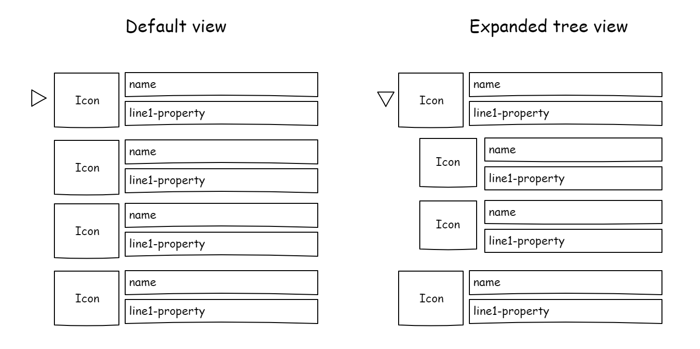

# mgt-file-list

The File List component displays a list of multiple folders and files by using the file/folder name, an icon, and other properties specicified by the developer. This component uses the [mgt-file](./mgt-file.md) component. The developer is able to specify a specific drive or or site, display a list of files based on insight type (trending, used, or shared), or provide queries render to a custom list of files.



## Supported functionality

| Feature | Priority | Notes |
| ------- | -------- | ----- |
| **v1** | | |
| Retrieve a list of files based on information provided | P0 | Can be from a specific drive or site or from an insight type |
| Use the `mgt-file` component to render each item | P0 | |
| **v2** | | |
| Render the children of folders hierarchically using a tree view | P1 | Potentially use the FAST tree view web component |
| Allow sorting of the files by the user | P2 | |

## Proposed Solution

### Example 1: No folder query, ids or insight type is provided

```<mgt-file-list><mgt-file-list>```

The request made: `GET /me/drive/root/children`

### Example 2: Developer provides a full query path for the folder to render the children of

```<mgt-file-list folder-query="/drives/123/items/456/children"></mgt-file-list>```

The request made: `GET /drives/123/items/456/children`

### Example 3: Developer specifies a type of insight

```<mgt-file-list insight-type=“trending”></mgt-file-list>```

The request made: `GET /me/insights/trending`

### Example 4: Developer provides drive id and item id

```<mgt-file-list drive-id=""123" item-id="456></mgt-file-list>```

The request made : `GET /drives/123/items/456/children`

### Example 5: Developer provides a search query
```<mgt-file-list search-query="foo"></mgt-file-list>```

## Attributes and Properties

| Attribute | Property | Description |
| --------- | -------- | ----------- |
| `file-list-query` | `fileListQuery` | The full query or path to the drive or site that contains the list of files to render. |
| `file-queries` | `fileQueries` | An array of file queries to be rendered by the component.
 `files` | `files` | An array of files to get or set the list of files rendered by the component. Use this to access the files loaded by the component. Set this value to load your own files. |
| `insight-type` | `insightType` | Set to show the user’s trending, used, or shared files.
| `drive-id` | `driveId` | Id of the drive the folder belongs to. Must also provide either `item-id` or `item-path`. |
| `group-id` | `groupId` | Id of the group the folder belongs to. Must also provide either `item-id` or `item-path`. |
| `site-id` | `siteId` | Id of the site the folder belongs to. Must also provide either `{item-id}` or `{item-path}`. Provide `{list-id}` if you’re referencing a file from a specific list. |
| `item-id` | `itemId` | Id of the folder. Default query is `/me/drive/items`. Provide `{drive-id}`, `{group-id}`, `{site-id}`, or `{user-id}` to query a specific location. |
| `item-path` | `itemPath` | Item path of the folder (relative to the root). Default query is `/me/drive/root`. Provide `{drive-id}`, `{group-id}`, `{site-id}`, or `{user-id}` to query a specific location. |
| `page-size` | `pageSize` | A number value to indicate the maximum number of files to show per page. |

## APIs and Permissions

| Query | Use if | Permission Scopes |
| ----- | ------ | ----------------- |
| `GET /me/drive/root/children`	| Default (no identifiers or query provided) | Files.Read, Files.Read.All, Sites.Read.All |
| `GET /drives/{drive-id}/items/{item-id}/children` | `{drive-id}` AND `{item-id}` | " |
| `GET /groups/{group-id}/drive/items/{item-id}/children` | `{group-id}` AND `{item-id}` | " |
| `GET /me/drive/items/{item-id}/children` | ONLY `{item-id}` | " | 
| `GET /sites/{site-id}/drive/items/{item-id}/children` | `{site-id}` AND `{item-id}` | " |
| `GET /users/{user-id}/drive/items/{item-id}/children` | `{user-id}` AND `{item-id}` | " |
| `GET /drives/{drive-id}/root:/{item-path}:/children` | `{drive-id}` AND `{item-path}` | " |
| `GET /groups/{group-id}/root:/{item-path}:/children` | `{group-id}` AND `{item-path}` | " |
| `GET /sites/{site-id}/root:/{item-path}:/children` | `{site-id}` AND `{item-path}` | " |
| `GET /users/{user-id}/root:/{item-path}:/children` | `{user-id}` AND `{item-path}` | " |
| `GET /me/drive/root:/{item-path}:/children` | only `{item-path}` | " |
| `GET /me/insights/trending` | `insight-type` is trending | Sites.Read.All |
| `GET /users/{id or userPrincipalName}/insights/trending` | {user-id or upn} AND `insight-type` is `trending` | " | 
| `GET /me/insights/used` | `insight-type` is `used` | " |
| `GET /users/{id or userPrincipalName}/insights/used`  | {user-id or upn} AND `insight-type` is `used` | " |
| `GET /me/insights/shared` | `insight-type` is shared | " |
| `GET /users/{id or userPrincipalName}/insights/shared?$filter=((lastshared/sharedby/id eq '${user-id}') and (resourceReference/type eq 'microsoft.graph.driveItem'))` | `{user-id or upn}` AND `insight-type` is `shared` | " |
|`POST /beta/search/query` Request body: `{"requests": [{"entityTypes": ["driveItem", "listItem"], "query":{"queryString":"foo"}}]}` | `search-query` | Files.Read, Files.Read.All, Files.ReadWrite.All, Sites.Read.All, Sites.ReadWrite.All |

## Templates

| Data type | Data context | Description |
| ----------- | -------------- | ------------ |
| default | `files`: list of file objects | The default template replaces the entire component with your own. |
| file | `file`: file object | The template used to render each file. |
| no-data | No data context is passed | The template used when no data is available. |
| loading | No data context is passed | The template used while the component loads state.
