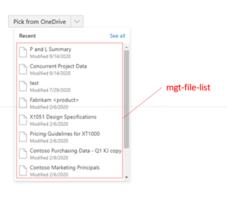

# mgt-file-picker

The file picker component provides a button, a drop down list of files, and as well as button to launch a full file browsing experience to enable a user to select a file from OneDrive or SharePoint for further action. This component uses the [mgt-file](./mgt-file.md) components to display files in the dropdown. The selected file object(s) is returned to the developer.



## Supported functionality

| Feature | Priority | Notes |
| ------- | -------- | ----- |
| **v1** | | |
| Provide a button that renders a drop down when clicked | P0 | |	
| Retrieve files based on specified insight type | P0 | |
| Use `mgt-file` components to render each file inside of the drop down | P0 | |
| On selection of a file, a `selectionChanged` event is fired | P0 | |	
| The selected file object(s) is accessible by the developer for further action |P0 | |	
| Extended file picker is launched when “See all” is clicked | P0 | |
| **v2** | | |
| Retrieve files from a specified insight type or from a specific drive location based on identifiers provided by developer | P1 | |
| Ability for developer to toggle between single-select and multiselect | P1 | | 
| Visual indication of selected files | P2 | |
| Render the selected files | P2 | |

## Proposed Solution

### Example 1 (v1): Show the user's top 10 most recently used files to select from
```<mgt-file-picker insight-type=“used” show-max=“10”></mgt-file-picker>```

### Example 2 (v2): Show a specific folder in OneDrive to select files from
```<mgt-file-picker drive-id=“123” item-id=“456”></mgt-file-picker>```

## Attributes and Properties

| Attribute | Property | Description |
| --------- | -------- | ----------- |
| **v1** | | |
| `files` | `files` | An array of files to get or set the list of files rendered by the component. Use this to access the files loaded by the component. Set this value to load your own files. |
| `insight-type` | `insightType` | Set to show the user’s trending, used, or shared files. |
| `show-max` | `showMax` | A number value to indicate the maximum number of files to show. |
| **v2** | | |
| `file-list-query` | `fileListQuery` | The full query or path to the folder in a drive or site to retrieve the list of files from |
| `file-queries` | `fileQueries` | An array of file queries to be rendered by the component |
| `drive-id` | `driveId` | Id of the drive the folder belongs to. Must also provide either `item-id` or `item-path`. |
| `group-id ` | `groupId` | Id of the group the folder belongs to. Must also provide either `item-id` or `item-path`. |
| `site-id` | `siteId` | Id of the site the folder belongs to. Must also provide either `{item-id}` or `{item-path}`. Provide `{list-id}` if you’re referencing a file from a list. |
| `item-id` | `itemId` | Id of the folder. Default query is `/me/drive/items`. Provide `{drive-id}`, `{group-id}`, `{site-id}`, or `{user-id}` to query a specific location. |
| `item-path` | `itemPath` | Item path of the folder. Default query is `/me/drive/root`. Provide `{drive-id}`, `{group-id}`, `{site-id}`, or `{user-id}` to query a specific location. |
| `multiselect` | `multiselect` | Enable/Disable selection of more than 1 file. Default is `false`.|

## Events

| Event | Description |
| ----- | ----------- |
| filesSelected | Fired when the user selects a file |

## APIs and Permission

| Query | Use if | Permission Scopes |
| ----- | ------ | ----------------- |
| **v1** | | |
| `GET /me/insights/trending` | `insight-type` is trending | Sites.Read.All |
| `GET /me/insights/used` | `insight-type` is `used` | " |
| `GET /me/insights/shared` | `insight-type` is shared | " |
| **v2** | | |
| `GET /me/drive/root/children`	| Default (no identifiers or query provided) | Files.Read, Files.Read.All, Sites.Read.All |
| `GET /drives/{drive-id}/items/{item-id}/children` | `{drive-id}` AND `{item-id}` | " |
| `GET /groups/{group-id}/drive/items/{item-id}/children` | `{group-id}` AND `{item-id}` | " |
| `GET /me/drive/items/{item-id}/children` | ONLY `{item-id}` | " | 
| `GET /sites/{site-id}/drive/items/{item-id}/children` | `{site-id}` AND `{item-id}` | " |
| `GET /users/{user-id}/drive/items/{item-id}/children` | `{user-id}` AND `{item-id}` | " |
| `GET /drives/{drive-id}/root:/{path-relative-to-root}:/children` | `{drive-id}` AND `{path-relative-to-root}` | " |

## Templates

| Data type | Data Context | Description |
| --------- | ------------ | ----------- |
| default | null: no data | The template used to override the rendering of the entire component |
| loading | null: no data | The template used to render the state of the picker while the request to Graph is being made. |
| error | null: no data | The template used if no files are returned |
| file | file: the file details object | The template to render files in the dropdown |
| button | null: no data | The template used to override the default button that opens the picker |
| header | null: no data | The template used to override the header (text and "See All" button) displayed in the picker |