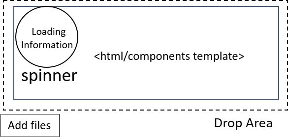

# File upload extension for mgt-file-list component

The file upload extension for File-List component provides the capability of users upload files to pre defined Graph queries based on Onedrive, SharePoint Libraries.
This files can be uploaded using a Upload button or by drag and drop effect in File-list component.
During the upload of file a progress status bar with cancellation option is visible to user. 
If the upload is successful a green check status icon appear in associated document.
If upload failed a red icon appear in associated document with gray shadow.  





## Supported functionality

| Feature | Priority | Notes |
| ------- | -------- | ----- |
| **v1** | | |
| Provide upload button and drag and drop functionality to upload files to Libraries | P0 | |	
| Provide file progress status and cancelation option | P0 | |
| Provide successful or fail icon when upload is completed.  | P0 | |


## Proposed Solution

Folder with file to upload: ```/folder/test.txt```

### Example 1: No query, path or ids is provided

```<mgt-file-list file-upload="true" excluded-file-extensions="[jpg,png,zip]" max-file-size="10000" max-upload-file="10" ><mgt-file-list>```

The request made is < 4 MB >: `POST /me/drive/root:/folder/test.txt:/content`

The request made is > 4 MB: `POST /me/drive/root:/folder/test.txt:/createUploadSession`

### Example 2: Developer provides a Item Id associated with folder

```<mgt-file-list item-id="123" file-upload="true" excluded-file-extensions="[jpg,png,zip]" max-file-size="10000" max-upload-file="10"><mgt-file-list>```

The request made is < 4 MB: `POST /me/drive/items/123:/folder/test.txt:/content`

The request made is > 4 MB: `POST /me/drive/items/123:/folder/test.txt:/createUploadSession`

### Example 3: Developer only provides Item Path

```<mgt-file-list item-path="/Custom" file-upload="true" excluded-file-extensions="[jpg,png,zip]" max-file-size="10000" max-upload-file="10"><mgt-file-list>```

The request made is < 4 MB >: `POST /me/drive/root:/Custom/folder/test.txt:/content`

The request made is > 4 MB: `POST /me/drive/root:/Custom/folder/test.txt:/createUploadSession`


### Example 4: Developer provides drive id, item id and item path

```<mgt-file-list drive-id="123" item-id="456" item-path="/Custom" file-upload="true" excluded-file-extensions="[jpg,png,zip]" max-file-size="10000" max-upload-file="10" ></mgt-file-list>```

The request made is < 4 MB >: `POST /drives/123/items/456:/Custom/folder/test.txt:/content`

The request made is > 4 MB: `POST /drives/123/items/456:/Custom/folder/test.txt:/createUploadSession`

### Example 5: Developer provides Site id, item id and item path

```<mgt-file-list site-id="123" item-id="456" item-path="/Custom" file-upload="true" excluded-file-extensions="[jpg,png,zip]" max-file-size="10000" max-upload-file="10" ></mgt-file-list>```

The request made is < 4 MB >: `POST /sites/123/drive/items/456:/Custom/folder/test.txt:/content`

The request made is > 4 MB: `POST /sites/123/drive/items/456:/Custom/folder/test.txt:/createUploadSession`

## Attributes and Properties

| Attributes | Property | Description |
|--------------------- |--------------------- |--------------------- |
| folder-query | folderQuery | The full query or path to the drive where to upload the file |
| drive-id | driveId | ID of the drive where the target folder to upload the file belongs to. Must also provide either `item-id` or `item-path` |
| group-id | groupId | ID of the group where the target folder to upload the file belongs to. Must also provide either` item-id` or `item-path` |
| site-id | siteId | ID of the site where the target folder to upload the file belongs to. Must also provide either `item-id` or `item-path` |
| user-id | userId | ID of the user where the target folder to upload the file belongs to. Must also provide either `item-id` or `item-path`  |
| item-id | itemId | The full query or path to the drive where to upload the file |
| item-path | itemPath | Item path of the folder (relative to the root) to upload the file to. Default query is `/me/drive/root`. Provide `{drive-id}`, `{group-id}`, `{site-id}`, `{item-id}`, or `{user-id}` to query a specific location |
| enable-file-upload | enableFileUpload | Boolean to enable or disable file upload extension, default is false  |
| excluded-file-extensions | excludedFileExtensions | String Array of file extension to be excluded from file upload |
| max-file-size | maxFileSize | Number to restrict upload size (KB)  |
| max-upload-file | maxUploadFile | Number, default value are 10 Files. |


## APIs and Permissions

| Configuration | Permissions | API | Methods | Description |
|--------------------- |--------------------- |--------------------- |--------------------- |--------------------- |
| Default (no identifiers or query provided) | Files.ReadWrite.All | `POST me/drive/root:${file.fullPath}:/` | `content, createUploadSession`  | Include File Name and/or subfolders to simulate uploaded folder structure
| Provide ONLY `{item-path}`  | Files.ReadWrite.All | `POST /me/drive/root:{item-path}${file.fullPath}:/` | `content, createUploadSession` | Include File Name and/or subfolders to simulate uploaded folder structure
| Provide ONLY `{item-id}`  | Files.ReadWrite.All | `POST /me/drive/items/{item-id}:${file.fullPath}:/` | `content, createUploadSession` | Include File Name and/or subfolders to simulate uploaded folder structure
| Provide `{site-id}` AND `{item-id}` | Files.ReadWrite.All |  `POST /sites/{site-id}/drive/items/{item-id}:${file.fullPath}:/` | `content, createUploadSession` | Include File Name and/or subfolders to simulate uploaded folder structure
| Provide `{site-id}` AND `{item-path}` | Files.ReadWrite.All | `POST /sites/{site-id}/root:/{item-path}${file.fullPath}:/`  | `content, createUploadSession` | Include File Name and/or subfolders to simulate uploaded folder structure
| Provide `{drive-id}` AND `{item-path}` | Files.ReadWrite.All | `POST /drives/{drive-id}/root:/{item-path}${file.fullPath}:/` | `content, createUploadSession` | Include File Name and/or subfolders to simulate uploaded folder structure
| Provide `{drive-id}` AND `{item-id}`| Files.ReadWrite.All | `POST  /drives/{driveId}/items/{itemId}:${file.fullPath}:/` | `content, createUploadSession` | Include File Name and/or subfolders to simulate uploaded folder structure
| Provide `{group-id}` AND `{item-id}` | Files.ReadWrite.All | `POST /groups/{group-id}/items/{itemId}:${file.fullPath}:/` | `content, createUploadSession` | Include File Name and/or subfolders to simulate uploaded folder structure
| Provide `{group-id}` AND `{item-path}` | Files.ReadWrite.All | `POST /groups/{group-id}/root:/{item-path}${file.fullPath}:/` | `content, createUploadSession` |  Include File Name and/or subfolders to simulate uploaded folder structure
| Provide only `{item-path}` | Files.ReadWrite.All | `POST /me/drive/root:/{item-path}${file.fullPath}:/` | `content, createUploadSession` | Include File Name and/or subfolders to simulate uploaded folder structure
| Provide `{user-id}` AND `{item-id}`| Files.ReadWrite.All | `POST /me/{userId}/items/{itemId}:${file.fullPath}:/` | `content, createUploadSession` | Include File Name and/or subfolders to simulate uploaded folder structure
