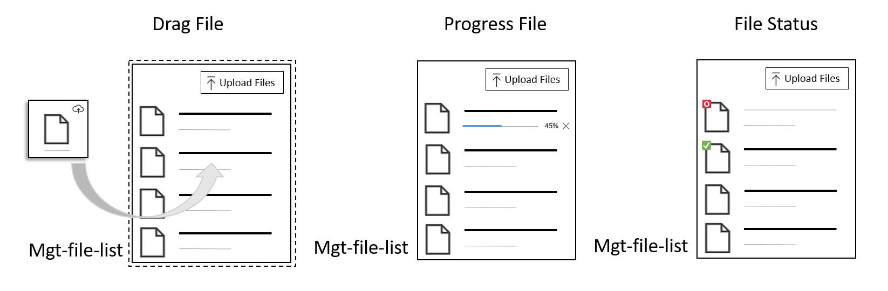

# mgt-file-upload


The file upload component provide a button or a drag and drop effect where file or folder with files can be uploaded to pre defined Graph queries based on Onedrive, SharePoint Libraries. During the upload of file(s) the following actions can be seen by the user (Loading process, cancellation of current upload, number of files to upload and percentage of upload status). If the upload is successful/failed a status message returns to user. 




## Supported functionality

| Feature | Priority | Notes |
| ------- | -------- | ----- |
| **v1** | | |
| Provide upload button and drag and drop functionality to upload files to Libraries | P0 | |	
| Provide status information of Uploaded files | P0 | |
| Provide an upload button when browser doesn't support drag and drop funcionality for Mobile/accessibility reason.  | P0 | |

## Proposed Solution

Folder with file to upload: ```/folder/test.txt```

### Example 1: No query, path or ids is provided

```<mgt-file-upload><mgt-file-upload>```

The request made is < 4 MB >: `POST /me/drive/root:/folder/test.txt:/content`

The request made is > 4 MB: `POST /me/drive/root:/folder/test.txt:/createUploadSession`

### Example 2: Developer provides a Item Id associated with folder

```<mgt-file-upload item-id="123"><mgt-file-upload>```

The request made is < 4 MB: `POST /me/drive/items/123:/folder/test.txt:/content`

The request made is > 4 MB: `POST /me/drive/items/123:/folder/test.txt:/createUploadSession`

### Example 3: Developer only provides Item Path

```<mgt-file-upload item-path="/Custom"><mgt-file-upload>```

The request made is < 4 MB >: `POST /me/drive/root:/Custom/folder/test.txt:/content`

The request made is > 4 MB: `POST /me/drive/root:/Custom/folder/test.txt:/createUploadSession`


### Example 4: Developer provides drive id, item id and item path

```<mgt-file-upload drive-id="123" item-id="456" item-path="/Custom" ></mgt-file-upload>```

The request made is < 4 MB >: `POST /drives/123/items/456:/Custom/folder/test.txt:/content`

The request made is > 4 MB: `POST /drives/123/items/456:/Custom/folder/test.txt:/createUploadSession`

### Example 5: Developer provides Site id, item id and item path

```<mgt-file-upload site-id="123" item-id="456" item-path="/Custom" ></mgt-file-upload>```

The request made is < 4 MB >: `POST /sites/123/drive/items/456:/Custom/folder/test.txt:/content`

The request made is > 4 MB: `POST /sites/123/drive/items/456:/Custom/folder/test.txt:/createUploadSession`

## Attributes and Properties

| Attributes | Property | Description |
|--------------------- |--------------------- |--------------------- |
| folder-query | folderQuery | The full query or path to the drive where to upload the file |
| drive-id | driveId | ID of the drive where the target folder to upload the file belongs to. Must also provide either `item-id` or `item-path` |
| group-id | groupId | ID of the group where the target folder to upload the file belongs to. Must also provide either` item-id` or `item-path` |
| site-id | siteId | ID of the site where the target folder to upload the file belongs to. Must also provide either `item-id` or `item-path` |
| user-id | userId | ID of the user where the target folder to upload the file belongs to. Must also provide either `item-id` or `item-path`  |
| item-id | itemId | The full query or path to the drive where to upload the file |
| item-path | itemPath | Item path of the folder (relative to the root) to upload the file to. Default query is `/me/drive/root`. Provide `{drive-id}`, `{group-id}`, `{site-id}`, `{item-id}`, or `{user-id}` to query a specific location |
| show-progress | showProgress | A boolean to indicate whether to show the progress for uploading the file |
| file-extensions | fileExtensions | String Array of file extension to exclude from file upload |
| file-size | fileSize | Number to restrict upload size (KB) |
| drag-drop | dragDrop | Boolean field, if yes creates base Template for drag and drop area + Localization for upload label |


## APIs and Permissions

| Configuration | Permissions | API | Methods | Description |
|--------------------- |--------------------- |--------------------- |--------------------- |--------------------- |
| Default (no identifiers or query provided) | Files.ReadWrite.All | `POST me/drive/root:${file.fullPath}:/` | `content, createUploadSession`  | Include File Name and/or subfolders to simulate uploaded folder structure
| Provide ONLY `{item-path}`  | Files.ReadWrite.All | `POST /me/drive/root:{item-path}${file.fullPath}:/` | `content, createUploadSession` | Include File Name and/or subfolders to simulate uploaded folder structure
| Provide ONLY `{item-id}`  | Files.ReadWrite.All | `POST /me/drive/items/{item-id}:${file.fullPath}:/` | `content, createUploadSession` | Include File Name and/or subfolders to simulate uploaded folder structure
| Provide `{site-id}` AND `{item-id}` | Files.ReadWrite.All |  `POST /sites/{site-id}/drive/items/{item-id}:${file.fullPath}:/` | `content, createUploadSession` | Include File Name and/or subfolders to simulate uploaded folder structure
| Provide `{site-id}` AND `{item-path}` | Files.ReadWrite.All | `POST /sites/{site-id}/root:/{item-path}${file.fullPath}:/`  | `content, createUploadSession` | Include File Name and/or subfolders to simulate uploaded folder structure
| Provide `{drive-id}` AND `{item-path}` | Files.ReadWrite.All | `POST /drives/{drive-id}/root:/{item-path}${file.fullPath}:/` | `content, createUploadSession` | Include File Name and/or subfolders to simulate uploaded folder structure
| Provide `{drive-id}` AND `{item-id}`| Files.ReadWrite.All | `POST  /drives/{driveId}/items/{itemId}:${file.fullPath}:/` | `content, createUploadSession` | Include File Name and/or subfolders to simulate uploaded folder structure
| Provide `{group-id}` AND `{item-id}` | Files.ReadWrite.All | `POST /groups/{group-id}/items/{itemId}:${file.fullPath}:/` | `content, createUploadSession` |  
Include File Name and/or subfolders to simulate uploaded folder structure
| Provide `{group-id}` AND `{item-path}` | Files.ReadWrite.All | `POST /groups/{group-id}/root:/{item-path}${file.fullPath}:/` | `content, createUploadSession` |  Include File Name and/or subfolders to simulate uploaded folder structure
| Provide only `{item-path}` | Files.ReadWrite.All | `POST /me/drive/root:/{item-path}${file.fullPath}:/` | `content, createUploadSession` | Include File Name and/or subfolders to simulate uploaded folder structure
| Provide `{user-id}` AND `{item-id}`| Files.ReadWrite.All | `POST /me/{userId}/items/{itemId}:${file.fullPath}:/` | `content, createUploadSession` | Include File Name and/or subfolders to simulate uploaded folder structure


## Templates

| Data type	 | Data context	 | Description |
| -------------------- | -------------------- | -------------------- |
| default | `files`: list of files objects to upload. | The default template replaces the entire component with your own. |
| end-status | `filesStatus`: Final Status message of upload with files report  | The template used when Upload process is finish. |
| loading |  `files`: Status of uploaded files and Bytes of upload objects | The template when files are being uploaded where developer can create their own loading process. |