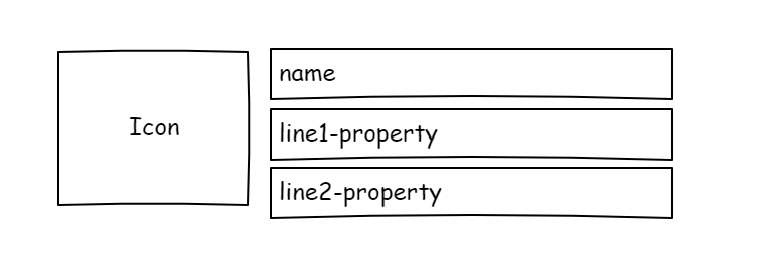

# mgt-file

The File component is used to represent an individual file/folder from OneDrive or SharePoint by displaying information such as the file/folder name, an icon indicating the file type, and other properties such as the author, last modified date, or other details selected by the developer. The developer or application provides the identifiers for a file and the component will generate the query to retreive the file based on the identifiers provided. This component can be used on it's own or as part of the [mgt-file-list](./mgt-file-list.md) and [mgt-file-picker](./mgt-file-picker.md) components. 



## Supported functionality

| Feature | Priority | Notes |
| ------- | -------- | ----- |
| Retreieve a file from Microsoft Graph using the query or identifiers provided | P0 | |
| Display the name of the file/folder| P0| |
| Display an icon indicating if it's a folder or file and the file type| P0 | Icons needed include generic folder icon, .docx, .pptx, .xlsx, and generic file icon for other file types |
| Display relevant details of the file | P0 | Developer should be able to configure what details are being rendered |

## Proposed Solution

### Example 1: Developer provides the full query path for the file
```<mgt-file file-query="/me/drives/items/123" view="twolines"></mgt-file>```

The request made: `GET /me/drives/items/123`

### Example 2: Developer provides a site-id and item-id
```<mgt-file site-id="123" item-id="456"></mgt-file>```

The request made: `GET /sites/123/drive/items/123`

### Example 3: Developer provides only an item-id

```<mgt-file item-id="123"></mgt-file>```

The request made: `GET /me/drive/items/123`

## Example 4: The component is used inside of a File List component that uses an insight type.

```<mgt-file insight-type="trending" insight-id="123"></mgt-file>```

The request made: `GET /me/insights/trending/123/resource`

## Attributes and Properties

| Attribute | Property | Description |
| --------- | -------- | ----------- |
| `file-query` | `fileQuery` | The full query or path to the file to be retrieved. |
| `drive-id` | `driveId` | The Id of the drive the file belongs to. Must also provide either `item-id` or `item-path`. |
| `group-id` | `groupId` | Id of the group the file belongs to. Must also provide either `item-id` or `item-path`. |
| `site-id` | `siteId` | Id of the site the file belongs to. Must also provide either `{item-id}` or `{item-path}`. Provide the `{list-id}` too if you’re referencing a file from a specific list. |
| `list-id` | `listId` | Id of the list the file belongs to. Must also provide `{site-id}` and `{item-id}`. |
| `item-id` | `itemId` | Id of the file. Default query is `/me/drive/items`. Provide `{drive-id}`, `{group-id}`, `{site-id}`, or `{user-id}` to query a specific location. |
| `item-path` | `itemPath` | Item path of the file. Default query is `/me/drive/root`. Provide `{drive-id}`, `{group-id}`, `{site-id}`, or `{user-id}` to query a specific location. |
| `insight-type` | `insightType` | Type of insight the file is retrieved from. Can be `trending`, `used`, or `shared`. |
| `insight-id` | `insightId` | Id of the insight resource. |
| `file-details` | `fileDetails` | Set to an object representing a file |
| `file-icon` | `fileIcon` | Set to an icon to show for the file |
| `view` | `view` | Set to control how the file is rendered. The default is `oneline`. <br>`image` - show only the icon <br>`oneline` - show the icon and one line of text (default is file `name`) <br>`twolines` - show the icon and two lines of text (`name` and `lastModifiedDateTime` by default)<br> `threelines` - show the icon and three lines of text (`name`, `lastModifiedDateTime`, and `displayName` of the author by default) |
| `line1-property` | `line1Property` | Sets the property of `fileDetails` to use for the first line of text. Default is `name` of the file. |
| `line2-property` | `line2Property` | Sets the property of `fileDetails` to use for the second line of text. Default is `lastModifiedDateTime`. |
| `line3-property` | `line3Property` | Sets the property of `fileDetails` to use for the third line of text. Default is `displayName` of the file author. |


## APIs and Permissions

| Query | Use if | Permission Scopes |
| ----- | ------ | ----------------- |
| `GET /drives/{drive-id}/items/{item-id}` | `{drive-id}` AND `{item-id}` | Files.Read, Files.Read.All, Sites.Read.All |
| `GET /drives/{drive-id}/root:/{item-path}` | `{drive-id}` AND `{item-path}` | " |
| `GET /groups/{group-id}/drive/items/{item-id}` | `{group-id}` AND `{item-id}` | " |
| `GET /groups/{group-id}/drive/root:/{item-path}` | `{group-id}` AND `{item-path}` | " |
| `GET /me/drive/items/{item-id}` | ONLY `{item-id}` | " |
| `GET /me/drive/root:/{item-path}` | ONLY `{item-path}` | " |
| `GET /sites/{site-id}/drive/items/{item-id}` | `{site-id}` AND `{item-id}` | " |
| `GET /sites/{site-id}/drive/root:/{item-path}` | `{site-id}` AND `{item-path}` | " |
| `GET /sites/{site-id}/lists/{list-id}/items/{item-id}/driveItem` | `{site-id}` AND `{list-id}` AND `{item-id}` | " |
| `GET /users/{user-id}/drive/items/{item-id}` | `{user-id}` AND `{item-id}` | " |
| `GET /users/{user-id}/drive/root:/{item-path}` | `{user-id}` AND `{item-path}` | " |
| `GET /me/insights/trending/{id}/resource` | `insight-type` is `trending` AND `{id}` | Sites.Read.All |
| `GET /users/{id or userPrincipalName}/insights/trending/{id}/resource` | `{user-id or upn}` AND `insight-type` is `trending` AND `{id}` | " |
| `GET /me/insights/used/{id}/resource` | `insight-type` is `used` AND `{id}` | " |
| `GET /users/{id or userPrincipalName}/insights/used/{id}/resource` | `{user-id or upn}` AND `insight-type` is `used` AND `{id}` | " |
| `GET /me/insights/shared/{id}/resource` | `insight-type` is `shared` AND `{id}` | " |
| `GET /users/{id or userPrincipalName}/insights/shared/{id}/resource` | `{user-id or upn}` AND `insight-type` is `shared` AND `{id}` | " |

## Templates

| Data Type | Data Context | Description |
| ----------- | -------------- | ------------- |
| loading | none | The template to render while the component is in a loading state. |
| no-data | none | The template to render when no file data is available. |
| default | file: the file details object | The default template replaces the entire component with your own. |
