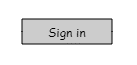
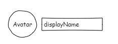
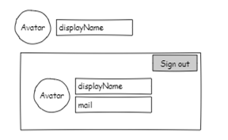
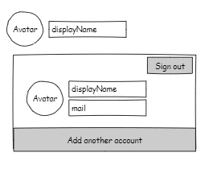
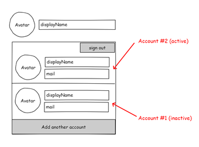
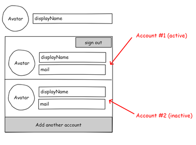

# mgt-login

The Login component provides a button and flyout to facilitate Microsoft Identity Platform authentication. The login component provides two states:
- A sign in button when there are no users signed in
- When a user or users are signed in, the control displays the display name and profile photo or avatar of the currently active account. When clicked, a flyout is rendered with additional profile data of all signed in accounts.

If the developer uses the component with a provider that supports multiple accounts (ex: MSAL 2.0), the flyout will include an option to add another account and display all currently signed in accounts.

The Login component uses Person components to represent signed in users.

## Scenarios and User Experience

Key personas:
- Developer: the developer using the Toolkit components in the development of an application
- End User/User: The user interacting with the components via the application built by the developer

### Scenario 1: The developer uses the login component with a provider that does not support multiple account sign in (ex: MSAL 1.0, Teams, etc.)
| User Action | Expected User Experience |
|-------------| -------------------------|
| The end user visits the application for the first time | <br> The end user is presented with a sign in button |
| The user clicks the sign in button and successfully completes the authentication flow | <br> The end user is redirected to the application. The login component displays the now signed-in user's avatar and display name (or other properties configured by the developer). All other Toolkit components on the page are re-rendered with the signed-in user's data. |
| The user clicks the login component in the signed-in state | <br> A flyout is rendered with additional profile data for the signed in account (default is avatar, displayName, and mail) and a button to sign out |
| The user clicks the login component or clicks outside of the component while the flyout is open | <br> The flyout is closed |
| The user opens the flyout and clicks the sign out button | <br> The user is taken through the sign out flow and then redirected to the home screen of the application. The login component provides a sign in button and all other components are re-rendered without user data |

### Scenario 2: The developer uses the login component with a provider that supports multiple account sign in (ex: MSAL 2.0)
| User Action | Expected User Experience |
| ------------| ------------------------ |
| The end user visits the application for the first time | <br> The end user is presented with a sign in button
| The user clicks the sign in button and successfully completes the authentication flow with *Account 1* | <br> The end user is redirected to the application. The login component displays the now signed-in user's avatar and display name (or other properties configured by the developer). All other Toolkit components on the page are re-rendered with the signed-in user's data. |
| The user clicks the login component in the signed-in state | <br> A flyout is rendered with additional profile data for the signed in account (default is avatar, displayName, and mail), a button to sign out, and a button to add another account |
| The user clicks the button to add another account and successfully completes the authentication flow with Account 2 | <br> The user is redirected to the application. The login component displays the avatar and display name for *Account 2*, which becomes the **active account**. All other Toolkit components are refreshed to render the data context of *Account 2*.
| The user clicks the login component in the signed-in state | <br> A flyout is rendered with additional profile data for each signed in account (default is avatar, displayName, and mail), a button to sign out, and a button to add another account. The active and inactive accounts are visually differentiated. |
| The user clicks on an inactive account inside of the flyout | <br> The active account and inactive accounts are switched. All other Toolkit components on the page are refreshed to show the data for the newly active account (*Account 1*)
| The user clicks the login component or clicks outside of the component while the flyout is open | <br> The flyout is closed |
| The user clicks the sign out button | <ul><li> **If >1 accounts are signed in**: The user is redirected to the authentication flow and is prompted to select the account they intend to sign out of. If the current active account is selected, the next inactive account is assigned to be the active account. The user is redirected to the application with all components refreshed with data for the newly active account. If the user selects an inactive account, the active account remains the same and the user is redirected back to the application. </li><li> **If only 1 account is signed in**: The user is taken through the sign out flow and then redirected to the home screen of the application. The login component provides a sign in button and all other components are re-rendered without user data </li></ul>|

## Supported Functionality

| Feature | Priority | Notes |
| ------- | -------- | ----- |
| **v1** | | |
| Render the appropriate version of the login component depending on which authentication provider is used | P0 | |
| Render a sign in button when no users are signed in | P0 | |
| Initiate the Identity platform authentication process when the sign in button or add another account is clicked | P0 | |
| Assign an account as active on successful sign in | P0 | |
| Display profile details for the active account in the signed in state | P0 | |
| Render the flyout when the component is clicked in the signed in state | P0 | |
| Display profile details for all signed in accounts in the flyout | P0 | |
| Provide a sign out button which initiates the sign out flow | P0 | |
| Properly reassign the active account and notify all other components when the user initates a change (selection of an inactive account or sign out of the active account) | P0 | |
| Provide templates for the developer to configure content rendered in the button and the flyout | P1 | |
| **v2** | | |
| Provide a view attribute/property to easily change the rendering of component in the signed in state | P2 | |
| Provide an attribute/property to configure additional actions/buttons inside of the flyout | P2 | |


## Proposed Solution

### Example 1: Login component is used with MSAL 1.0 Provider

```
<mgt-msal2-provider client-id="123"></mgt-msal2-provider>
<mgt-login></mgt-login>
```

Single account view of Login component is rendered.

### Example 2: Login component is used with MSAL 2.0 Provider

```
<mgt-msal2-provider client-id="123"></mgt-msal2-provider>
<mgt-login></mgt-login>
```

Multiple account view of the Login component is rendered.

### Example 3: Login component is used with no authentication provider

```
<mgt-login id="myLoginControl"></mgt-login>

<script>
let loginControl = document.getElementById('myLoginControl');
loginControl.userDetails = {
        displayName: 'Elise Yang',
        mail: 'elise@contoso.com',
        personImage: 'url'
    }
</script>
```

Single account view of the Login component is rendered.

## Attributes and Properties

| Attribute | Property | Description |
| --------- | -------- | ----------- |
| `user-details` | `userDetails` | Set the user object that will be displayed on the control |

## APIs and Permissions

The component uses the Person component to display users and inherits all permissions.

## Events

The following events are available on the initial version of the login component. We will deprecate all of these events and recommend using the events on the authentication providers instead.

| Event | Description |
| ----- | ----------- |
| ~~loginInitiated~~ | ~~The user clicked the sign in button to start the login process - cancelable~~ |
| ~~loginCompleted~~ | ~~The login process was successful and the user is unable to sign in~~ |
| ~~loginFailed~~ | ~~The user canceled the login process or was unable to sign in~~ |
| ~~logOutInitiated~~ | ~~The user started to logout - cancelable~~ |
| ~~logoutCompleted~~ | ~~The user signed out~~ |

## Templates

| Data type | Data context | Description |
| --------- | ------------ | ----------- |
| signed-in-button-content | `personDetails`: person object, `personImage`: person image string | The template used to render the content in the button when the user is signed in |
| signed-out-button-content | null | The template used to render the content in the button when the user is not signed in |
| flyout-commands | `handleSignOut`: sign out function | The template used to render the sign out command in the flyout |
| add-account-button | `handleAddAccount`: add account function | The template used to render the add another account command in the flyout |
| flyout-person-details | `personDetails`: person object, `personImage`: person image string | The template used to render the person details of the active account in the flyout |
| flyout-inactive-person-details | `personDetails`: person object, `personImage`: person image string | The template used to render the person details of inactive accounts in the flyout |
