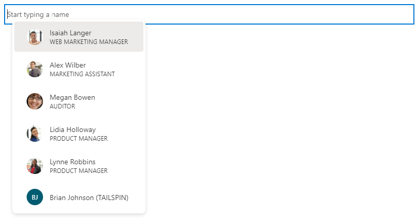

# mgt-people-picker

The people picker components provides a way for developers to select users, groups or contacts from Microsoft Graph. It offers a simple text area with a typeahead functionality and allows single or multiple selection of entities. 



## Attributes and Properties

| Attribute                  | Property                | Description                                                                                                                                                                                                                                                                                                                                                                                                                                                                                                                    |
| -------------------------- | ----------------------- | ------------------------------------------------------------------------------------------------------------------------------------------------------------------------------------------------------------------------------------------------------------------------------------------------------------------------------------------------------------------------------------------------------------------------------------------------------------------------------------------------------------------------------ |
| show-max                   | showMax                 | A number value to indicate the maximum number of people to show. the default value is 6.                                                                                                                                                                                                                                                                                                                                                                                                                                       |
| group-id                   | groupId                 | A string value that belongs to a Microsoft Graph defined group for further filtering of the search results.                                                                                                                                                                                                                                                                                                                                                                                                                    |
| transitive-search          | transitiveSearch        | A Boolean value to perform a transitive search returning a flat list of all nested members - by default transitive search is not used.                                                                                                                                                                                                                                                                                                                                                                                         |
| type                       | type                    | The type of entities to search for. Available options are: `person`, `group`, `any`. Default value is `person`. This attribute has no effect if `group-id` property is set.                                                                                                                                                                                                                                                                                                                                                    |
| user-type                  | userType                | The type of user to search for. Available options are: `any`, `user` for organizational users, or `contact` for contacts. Default value is `any`.                                                                                                                                                                                                                                                                                                                                                                              |
| group-type                 | groupType               | The group type to search for. Available options are: `unified`, `security`, `mailenabledsecurity`, `distribution`, `any`. Default value is `any`. This attribute has no effect if the `type` property is set to `person`.                                                                                                                                                                                                                                                                                                      |
| selected-people            | selectedPeople          | An array of selected people. Set this value to select people programmatically.                                                                                                                                                                                                                                                                                                                                                                                                                                                 |
| people                     | people                  | An array of people found and rendered in the search result                                                                                                                                                                                                                                                                                                                                                                                                                                                                     |
| placeholder                | placeholder             | The default text that appears to explain how to use the component. Default value is `Start typing a name`.                                                                                                                                                                                                                                                                                                                                                                                                                     |
| default-selected-user-ids  | defaultSelectedUserIds  | When provided a string of comma-separated Microsoft Graph user IDs, the component renders the respective users as selected upon initialization.                                                                                                                                                                                                                                                                                                                                                                                |
| default-selected-group-ids | defaultSelectedGroupIds | Similar to default-selected-user-ids, when provided a string of comma-separated Microsoft Graph group IDs, the component renders the respective groups as selected upon initialization.                                                                                                                                                                                                                                                                                                                                        |
| selection-mode             | selectionMode           | Used to indicate whether to allow selecting multiple items (users or groups) or just a single item. Available options are: `single`, `multiple`. Default value is `multiple`.                                                                                                                                                                                                                                                                                                                                                  |
| disabled                   | disabled                | Sets whether the people picker is disabled. When disabled, the user is not able to search or select people.                                                                                                                                                                                                                                                                                                                                                                                                                    |
| disable-images             | disableImages           | Sets whether to disable fetching and display of person images. When set to `true`, user initials are displayed instead.                                                                                                                                                                                                                                                                                                                                                                                                        |
| allow-any-email            | allowAnyEmail           | Indicates whether the people picker can accept email addresses without selecting a person. Default value is `false`. When you finish typing an email address, you can press comma (`,`), semicolon (`;`), tab or enter keys to add it.                                                                                                                                                                                                                                                                                         |
| user-ids                   | userIds                 | A string of comma-separated user IDs. They will only appear on the dropdown menu or your search results when you type a query. For example `48d31887-5fad-4d73-a9f5-3c356e68a038,24fcbca3-c3e2-48bf-9ffc-c7f81b81483d` will only display the two users in the dropdown when the input is focused. When you type a search text, it will return results that match the users in the two user IDs only.                                                                                                                           |
| group-ids                  | groupIds                | A string of comma-separated group IDs. The available results should be limited to the specified groups. Users that will appear on the dropdown menu and via the search experience should only come from the specified group IDs. For example `02bd9fd6-8f93-4758-87c3-1fb73740a315,06f62f70-9827-4e6e-93ef-8e0f2d9b7b23` will only display users belonging to these groups. When you type a search text, it will return results that match the users in the two group IDs only. Property is not used if `group-*` properties are defined. If the property is set, then the `type` is `person` by default. |
| user-filters               | userFilters             | Specifies the filter criteria to use when querying the users endpoint. It requires the `user-type` to be set to `user` or `contact`. By default, the `user-type` is `any` and this leads the querying to take place in the `people` endpoint block. Example: `user-filters="startsWith(displayName,'a')"`. This attribute is optional. Learn more about [the support for filter on user properties of Azure AD directory objects](/graph/aad-advanced-queries?tabs=http#user-properties).                                      |
| group-filters              | groupFilters            | Specifies the filter criteria to use when querying the `groups` endpoint. It requires the `type` to be set to `group`. Example: `group-filters="startsWith(displayName,'a')"`. This attribute is optional.                                                                                                                                                                                                                                                                                                                     |
| people-filters             | peopleFilters           | Specifies the filter criteria to use when querying the `people` endpoint. It is used as it is. Example: `people-filters="jobTitle eq 'Web Marketing Manager'"`. This attribute is optional. Learn more about [filtering and the supported capabilities on the people resource](/graph/people-example).                                                                                                                                                                                                                         |

## Usage

### Default
```html
<mgt-people-picker></mgt-people-picker>
```

### Show a maximum of 5 people in the selection area
```html
<mgt-people-picker show-max="5"></mgt-people-picker>
```

### Show users only from specified groups
```html
<mgt-people-picker group-ids="02bd9fd6-8f93-4758-87c3-1fb73740a315,06f62f70-9827-4e6e-93ef-8e0f2d9b7b23"></mgt-people-picker>
```

## Events

The following events are fired from the component.

| Event              | When is it emitted                                                         | Custom data                                                                                                                                                                                                                                                     | Cancelable | Bubbles |          Works with custom template           |
| ------------------ | -------------------------------------------------------------------------- | --------------------------------------------------------------------------------------------------------------------------------------------------------------------------------------------------------------------------------------------------------------- | :--------: | :-----: | :-------------------------------------------: |
| `selectionChanged` | The user added or removed a person from the list of selected/picked people | Array of selected people, where a person can be a Graph [user](/graph/api/resources/user), [person](/graph/api/resources/person) or [contact](/graph/api/resources/contact) with an additional `personImage` property that contains the URL of the user's photo |     No     |   No    | Yes, unless you override the default template |

## APIs and Permission

| Query                            | Use if                                                                          | Permission Scopes                                |
| -------------------------------- | ------------------------------------------------------------------------------- | ------------------------------------------------ |
| `GET /groups/{group-id}/members` | `group-id` or `group-ids` are set                                               | People.Read, User.Read.All, GroupMember.Read.All |
| `GET /me/people`                 | `type` set to `Person` or `any`                                                 | People.Read                                      |
| `GET /groups`                    | `type` set to `Group` or searching for users and `type` set to `Group` or `any` | Group.Read.All                                   |
| `GET /users`                     | `default-selected-user-ids` is set                                              | User.ReadBasic.All                               |
| `GET /me/people`                 | searching for users and `type` set to `Person` or `any`                         | People.Read, User.ReadBasic.All                  |

## Templates

| Data type       | Data context                      | Description                                                                           |
| --------------- | --------------------------------- | ------------------------------------------------------------------------------------- |
| default         | null: no data                     | The template used to override the rendering of the entire component.                  |
| loading         | null: no data                     | The template used to render the state of picker while request to graph is being made. |
| error           | null: no data                     | The template used if user search returns no users.                                    |
| no-data         | null: no data                     | An alternative template used if user search returns no users.                         |
| selected-person | person: The person details object | The template to render selected people.                                               |
| person          | person: The person details object | The template to render people in the dropdown.                                        |

## Cache

| Object store | Cached data    | Remarks                                                            |
| ------------ | -------------- | ------------------------------------------------------------------ |
| `groups`     | List of groups | Used when `type` is set to `PersonType.group`                      |
| `people`     | List of people | Used when `type` is set to `PersonType.person` or `PersonType.any` |
| `users`      | List of users  | Used when `groupId` specified                                      |