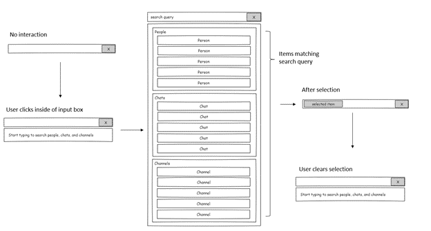

# mgt-picker

## Overview
The picker is a component that queries multiple Microosft Graph APIs to match a text string inputed by the user to allow the selection of a single resource. The picker will support a predefined list of resources and the developer will be able to specify which entities they would like each instance of the picker to query for and render results for. We will prioritize based on user scenarios and continue to add support for entities as needed to support those scenarios.

## User Scenarios

### Sharing via Teams (P0)

**Resources:** People (users only), Teams Channels, Teams Chats

### Other potential scenarios to be prioritized
- Sharing via email (people, groups)
- Sites and One Drive locations
- Files
- Send a Teams chat (people, chats)
- Search suggestions (suggestions, people, files)

## Supported Resources
- People (users only) - P0
- Teams Channels - P0
- Teams Chats - P0
- People (contacts)
- Groups 
- Sites
- Files
- Lists
- Messages
- Search Suggestions

## Proposed Solution

### Example: people, channels, chats
`<mgt-picker entity-types="people,channels,chats" max-results="5"></mgt-picker>`

`<mgt-picker entity-types="people,channels,chats" max-results="5,3,3"></mgt-picker>`

### Example: people and channels
`<mgt-picker entity-types="people,channels" max-results="5"></mgt-picker>`

### Example: channels and chats
`<mgt-picker entity-types="channels,chats" max-results="5"></mgt-picker>`
 
### Example: people only
`<mgt-picker entity-types="people" max-results="5"></mgt-picker>`

## Properties and Attributes

| Attribute | Property | Description | Values |
| --------- | -------- | ----------- | ------ |
| entity-types | entityTypes | Specify the entities to be rendered in the picker. They will be rendered in the order they are listed. | `people`, `channels`, `chats` |
| show-max | showMax | Specify the number of results to show for each entity type | Number or array of number, order corresponding to entity-types |

## Templates

| Data type | Data Context | Description |
| --- | --- |--- |
| default | null: no data | The template used to override the rendering of the entire component. |
| loading | null: no data | The template used to render the state of the picker while the request to Graph is being made |
| error | null: no data | The template used if search returns no results. |
| input-text | null: no data | The template used to render the default text inside of the input box. |
| person | person: the person details object | The template used to render people in the dropdown. |
| channel | channel: the channel object | The template used to render channels in the dropdown. |
| chats | chat: the chat object | The template used to render channels in the dropdown. |
| selected-item | selectedItem: the selected item object | The template used to render the selected item inside the input box. |

## APIs and Permissions

| API | Use When | Permissions |
| --- | --- | --- |
| GET [/me/people](https://docs.microsoft.com/en-us/graph/api/user-list-people?view=graph-rest-1.0&tabs=http) | entity-types includes people | People.Read |
| GET [/me/joinedTeams](https://docs.microsoft.com/en-us/graph/api/user-list-joinedteams?view=graph-rest-1.0&tabs=http) | entity-types includes channels | Team.ReadBasic.All |
| GET [/teams/${id}/channels](https://docs.microsoft.com/en-us/graph/api/channel-list?view=graph-rest-1.0&tabs=http) | entity-types includes channels | Channel.ReadBasic.All |
| GET [/me/chats](https://docs.microsoft.com/en-us/graph/api/chat-list?view=graph-rest-1.0&tabs=http) | entity-types includes chats | Chat.ReadBasic.All |

## Events

| Event | When it is fired |
| --- | --- |
| selectionChanged | Fired when the user makes a change in selection |