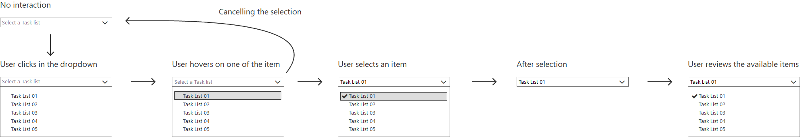

# mgt-picker

## Overview
The generic picker is a component that orchestrates multiple existing components from the Toolkit into a single search experience allowing selection of a **single resource**. The picker will support a predefined list of resources and the developer will be able to specify which entities they would like each instance of the picker to query for and render results for. We will prioritize based on user scenarios and continue to add support for entities as needed to support those scenarios.



The prioritized list of entities would be the following.

| Entity  | Description                                                | Priority |
| ------- | ---------------------------------------------------------- | -------- |
| files   | Drive Items are files or folders in OneDrive or SharePoint | P0       |
| user    | Users are organization users (not contacts)                | P0       |
| channel | Channels the current user is a member of                   | P0       |
| chats   | Group chats only the user is part of                       | P0       |

## User Scenarios

### Sharing in Teams

**Resources:** Users, Teams Channels, Teams Group Chats

### Selecting a file

**Resources:** File, Folder

## Proposed Solution

### Example: people, channels, chats
`<mgt-picker entity-types="people,channels,chats" max-results="5"></mgt-picker>`

`<mgt-picker entity-types="people,channels,chats" max-results="5,3,3"></mgt-picker>`

### Example: people and channels
`<mgt-picker entity-types="people,channels" max-results="5"></mgt-picker>`

### Example: channels and chats
`<mgt-picker entity-types="channels,chats" max-results="5"></mgt-picker>`
 
### Example: people only
`<mgt-picker entity-types="people" max-results="5"></mgt-picker>`

### Example: files only
`<mgt-picker entity-types="files" max-results="5"></mgt-picker>`

### Example: all
`<mgt-picker max-results="5"></mgt-picker>`

## Architecture of the component

The `mgt-picker` is a component that composes multiple other components. The value is to let the specialized components execute and render the appropriate queries without having a very complex picker.

A straight forward example would be with the files entities. We already have the `mgt-file` and `mgt-file-list` as part of the Toolkit, the integration with `mgt-picker` allows full reusability of the component.

### Role of `mgt-picker`

The role of `mgt-picker` is to understand the available components and orchestrate them with the input from the user. 

Using the picker with only the files as

```html
<mgt-picker entity-types="files" show-max="3"></mgt-picker>
```

The following graphics helps understand the user-flow for this scenario: 


1. The input area only showcases the types of entities supported in this configuration. In this case, only `files` are mentioned. 
2. When clicking on the input, the `mgt-pickers` adds to the DOM a `mgt-file-list` and triggers a zero keyword query to the Microsoft Graph Suggestions API. 
3. Once the results are coming back from the service, the results are passed to the `mgt-file-list` component that can then render them.
4. When the user adds a query in the input, `mgt-picker` should be sending a query to the Microsoft Graph Suggestions API. As soon as the results are back from the service, the results are passed to the `mgt-file-list` component.
5. When clicking on the expected result, `mgt-picker` would receive the selectedItem, would fire its own `selectionChanged` with the selected item and would render the `selected-item`.

## Properties and Attributes

| Attribute    | Property    | Description                                                                                            | Values                                                         |
| ------------ | ----------- | ------------------------------------------------------------------------------------------------------ | -------------------------------------------------------------- |
| entity-types | entityTypes | Specify the entities to be rendered in the picker. They will be rendered in the order they are listed. | `people`, `channels`, `chats`, `files`                         |
| show-max     | showMax     | Specify the number of results to show for each entity type                                             | Number or array of number, order corresponding to entity-types |

## Templates

| Data type     | Data Context                           | Description                                                                                  |
| ------------- | -------------------------------------- | -------------------------------------------------------------------------------------------- |
| default       | null: no data                          | The template used to override the rendering of the entire component.                         |
| loading       | null: no data                          | The template used to render the state of the picker while the request to Graph is being made |
| error         | null: no data                          | The template used if search returns no results.                                              |
| input-text    | null: no data                          | The template used to render the default text inside of the input box.                        |
| selected-item | selectedItem: the selected item object | The template used to render the selected item inside the input box.                          |


## APIs and Permissions

| API                                                                                                                   | Use When                       | Permissions           |
| --------------------------------------------------------------------------------------------------------------------- | ------------------------------ | --------------------- |
| POST [/beta/search/suggestions](#)                                                                                    | entity-types includes people   | People.Read           |
| GET [/me/joinedTeams](https://docs.microsoft.com/en-us/graph/api/user-list-joinedteams?view=graph-rest-1.0&tabs=http) | entity-types includes channels | Team.ReadBasic.All    |
| GET [/teams/${id}/channels](https://docs.microsoft.com/en-us/graph/api/channel-list?view=graph-rest-1.0&tabs=http)    | entity-types includes channels | Channel.ReadBasic.All |
| GET [/me/chats](https://docs.microsoft.com/en-us/graph/api/chat-list?view=graph-rest-1.0&tabs=http)                   | entity-types includes chats    | Chat.ReadBasic.All    |
| POST [/beta/search/suggestions](#)                                                                                    | entity-types includes files    | Sites.Read.All        |

## Events

| Event              | When it is fired                                    |
| ------------------ | --------------------------------------------------- |
| selectionChanged   | Fired when the user makes a change in selection     |
| searchQueryChanged | Fired when the user makes a change the search query |