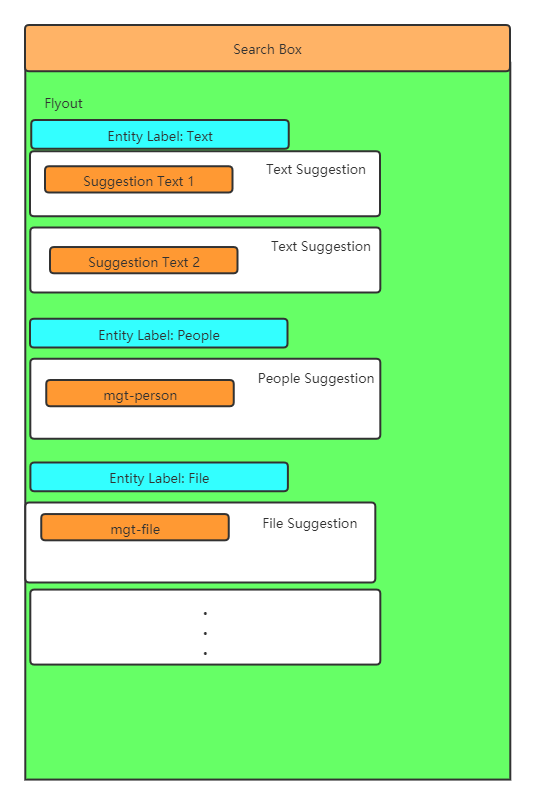
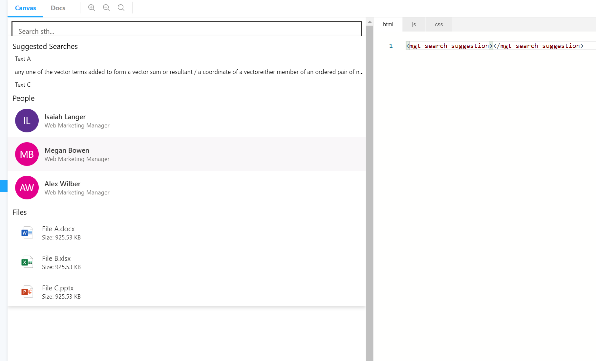
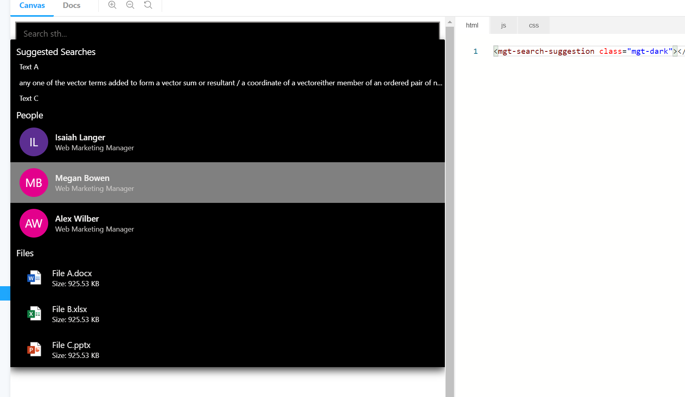

# mgt-search-suggestion

The suggestion component based on Graph Suggestion API, it provides a input box and flyout. When a query string typed in the input box, the flyout will rendered by the data from Graph Suggestion API, show some suggestions. it supports 3 kinds of entity types, File/Text/Suggestions. The component structure as below


## Supported functionality

| Feature | Priority | Notes |
| ------- | -------- | ----- |
| Retreieve text/people/file/ from Microsoft Graph endpoint based on the query string | P0 | |
| Display the text of the matched query and display the name of the file/people| P0| |
| Display the headImg or create a head icon for suggested people| P0| |
| Display an icon indicating if it's a folder or file and the file type| P0 | Icons needed include generic folder icon, .docx, .pptx, .xlsx, and generic file icon for other file types |
| Display relevant details of the file | P0 | Developer should be able to configure what details are being rendered |
| Provide basic default key down action and mouse action | P0 | when mouse move to an item, the backgroud/cursor should change. when arrow up/down, one item should be selected|
| Provide callback function to get data for supporting users customization actions | P0 | when user click one item, should provide a way for getting the suggested data and support customize actions. when enter key pressed, should provide a way for getting the focused data and support customize actions|
| Provide a way to user for override any entity type style | P1 | when user click one item, should provide a way for getting the suggested data and support customization. when enter key pressed, should provide a way for getting the focused data and support customization|

## Proposed Solution

### Example 1: basic usage without any callback function
```<mgt-search-suggestion></mgt-search-suggestion>```

### Example 2: Developer provides a site-id and item-id
```<mgt-search-suggestion id="search-suggestion"> </mgt-search-suggestion>```
```
#User can get this component then bind callback action to this component 

function onClickCallback(suggestionValue) {
    console.log('suggestion value:', suggestionValue);
    var searchValue = getSuggestionValue(suggestionValue);
    window.location.assign('https://www.bing.com/search?q=' + searchValue);
}

function onEnterKeyPressCallback(originalValue, selectedSuggestionValue) {
    console.log('original value:', originalValue);
    console.log('suggestion value:', selectedSuggestionValue);
    var searchValue = getSuggestionValue(selectedSuggestionValue);
    window.location.assign('https://www.bing.com/search?q=' + searchValue);
}

function getSuggestionValue(suggestionValue) {
    var searchValue = '';
    if (suggestionValue.entity == 'File') {
        searchValue = suggestionValue.name;
    } else if (suggestionValue.entity == 'Text') {
        searchValue = suggestionValue.text;
    } else if (suggestionValue.entity == 'People') {
        searchValue = suggestionValue.displayName;
    }
    return searchValue;
}

var obj = document.getElementById('search-suggestion');
obj.onClickCallback = onClickCallback;
obj.onEnterKeyPressCallback = onEnterKeyPressCallback;

```

### Example 3: Developer can select entity types

```<mgt-search-suggestion selected-entity-types="file, text, people"></mgt-search-suggestion>```

```<mgt-search-suggestion selected-entity-types="file, people"></mgt-search-suggestion>```

```<mgt-search-suggestion selected-entity-types="people, text"></mgt-search-suggestion>```

## Example 4: Developer can set each entity type's suggestion count

```<mgt-search-suggestion max-text-suggestion-count="3" max-file-suggestion-count="2" max-people-suggestion-count="3"></mgt-search-suggestion>```

## Attributes and Properties

| Attribute | Property | Description |
| --------- | -------- | ----------- |
| `max-text-suggestion-count` | `maxTextSuggestionCount` | The max suggestion count for text. |
| `max-people-suggestion-count` | `maxPeopleSuggestionCount` | The max suggestion count for people. |
| `max-file-suggestion-count` | `maxFileSuggestionCount` | The max suggestion count for file. |
| `selected-entity-types` | `selectedEntityTypes` | Suggestion entity types, free combination of text/people/file, use ',' to do the segmentation |
| `other properties` | `other properties` | awaiting for the graph suggestion API onboard. |

## Themes
### light(default)


### dark


## CSS custom properties

The `mgt-searach-suggestion` component defines the following CSS custom properties.

```css
mgt-search-suggestion {

    --suggestion-item-background-color--hover - {Color} background color for an hover item
    --suggestion-list-background-color - {Color} background color
    --suggestion-list-text-color - {Color} Text Suggestion font color
    /* other more properties same with mgt-person / mgt-file */
}
```

## APIs and Permissions

| Query | Use if | Permission Scopes |
| ----- | ------ | ----------------- |
| `awaiting for the graph suggestion API onboard. ` | `awaiting for the graph suggestion API onboard. ` | awaiting for the graph suggestion API onboard.  |


