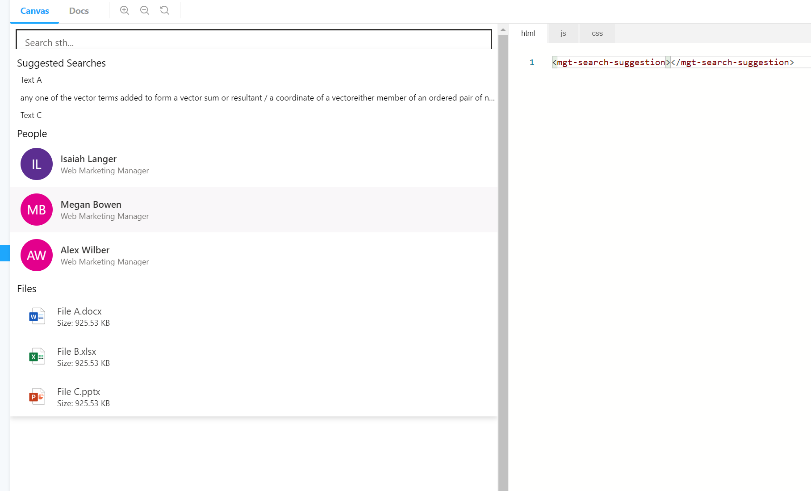
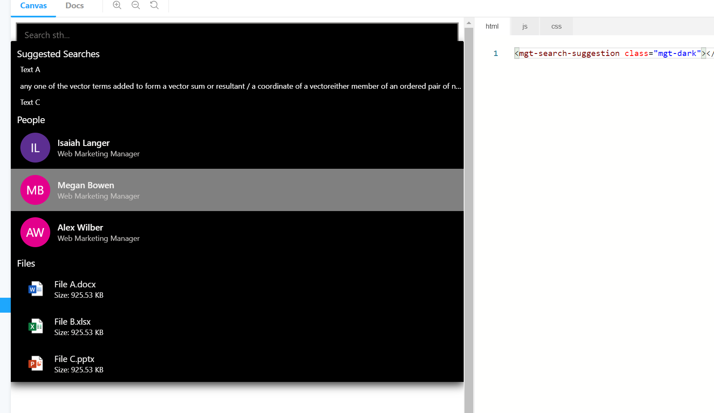

# mgt-search

The suggestion component based on Graph Suggestion API, it provides a input box and flyout. When a query string typed in the input box, the flyout will rendered by the data from Graph Suggestion API, show some suggestions. it supports 3 kinds of entity types, File/Text/Suggestions, and also opened 3 blank entity types for customizing
The component structure as below


## Supported functionality

| Feature | Priority | Notes |
| ------- | -------- | ----- |
| Retreieve text/people/file/ from Microsoft Graph endpoint based on the query string | P0 | |
| Enable other entity types from Microsoft Graph endpoint based on the query string | P0 | |
| Display the text of the matched query and display the name of the file/people| P0| |
| Display the headImg or create a head icon for suggested people| P0| |
| Display an icon indicating if it's a folder or file and the file type| P0 | Icons needed include generic folder icon, .docx, .pptx, .xlsx, and generic file icon for other file types |
| Display relevant details of the file | P0 | Developer should be able to configure what details are being rendered |
| Provide basic default key down action and mouse action | P0 | when mouse move to an item, the backgroud/cursor should change. when arrow up/down, one item should be selected|
| Provide callback function to get data for supporting users customization actions | P0 | when user click one item, should provide a way for getting the suggested data and support customize actions. when enter key pressed, should provide a way for getting the focused data and support customize actions|

## Templates

 `mgt-search` supports several [templates](../customize-components/templates.md) that you can use to replace certain parts of the component. To specify a template, include a `<template>` element inside a component and set the `data-type` value to one of the following.

| Data type | Data context | Description |
| --- | --- | --- |
| loading | null: no data | The template used to render the state of picker while request to graph is being made. |
| error | null: no data | The template used if user search returns no users. |
| no-data | null: no data | An alternative template used in dropdown list if suggestion returns no any results |
| flyout-header | null: no data | The template to render flyout header. |
| flyout-footer | null: no data | The template to render flyout footer. |
| suggestion-input | null: no data | The template to render search input box. |
| suggested-people-header | null: no data | The template to render people entity label. |
| suggested-query-header | null: no data | The template to render text entity label. |
| suggested-file-header | null: no data | The template to render file entity label. |
| customized-{other entity type}-header | null: no data | The template to render other entity label, for example customized-sample1-header |
| suggested-people | suggestionPeople[]: The people suggestion details  | The template to render people entity. |
| suggested-query | suggestionQuery[]: The text suggestion details  | The template to render text entity. |
| suggested-file | suggestionFile[]: The file suggestion details  | The template to render file entity. |
| customized-{other entity type} | any[]: Customizing suggestion details  | The template to render customized entity, for example customized-sample1 |

The following examples shows how to use customized template `suggested-query`.

```html
<mgt-search>
    <template data-type="suggested-query">
        <div>{{query}}</div>
    </template>
</mgt-search>
```


## Customized
Customized entity types must be supported by microsoft graph suggestion API.
```html
<mgt-search entity-types="query,file,people,sample1">
    <template data-type="customized-sample1-header">
        <div>header hahaha</div>
    </template>

    <template data-type="customized-sample1">
        <div>{{this}}</div>
    </template>
</mgt-search>
```

## Proposed Solution

## Example

### Example 1: basic usage
```<mgt-search></mgt-search>```

### Example 2: get suggestion data and define click and enter key action by adding a listener
```
<mgt-search> </mgt-search>

<script>

document.querySelector('mgt-search').addEventListener('suggestionClick', e => {
    console.log(e.detail);
});

document.querySelector('mgt-search').addEventListener('enterPress', e => {
  console.log(e.detail);
});

</script>

```

### Example4: Select entity types & Sort & Suggestion Amount
It allows customized entity order and max suggestion account by using entity-types properties:
For example below shows
Order: query, file, people
Amount: 2,1,3 ( 3 is default value)
```html
  <mgt-search entity-types="query-2, file-1, people"></mgt-search>
```

```html
  <mgt-search entity-types="query-2, people"></mgt-search>
```

```html
  <mgt-search entity-types="query-2, people, sample1-4"></mgt-search>
```

## Events

The following events are fired from the component.

| Event | Description |
| --- | --- |
| `suggestionClick` | When click an entity , the listener will be trigged. the suggested value of the clicked item as a parameter|
| `enterPress` | When press enter key, the listener will be trigged, it has originalValue( input box value) and suggestedValue (suggestion) as parameters|

## Attributes and Properties

| Attribute | Property | Description |
| --------- | -------- | ----------- |
| `entity-types` | `entityTypes` | Suggestion entity types, free combination of query/people/file or other entity types supported by suggestion API, it determines the order,  use ',' to do the segmentation, use '-' to do the amount limitation. for example 'file-2, query-1, people', it menas order: file,query, people.  Entity Types: file, query, people. Amount Limitation: file is 2, query is 1, people is 3 due to the default value is 3 |
| `other properties` | `other properties` | awaiting for the graph suggestion API onboard. |

## Themes
### light(default)


### dark


## CSS custom properties

The `mgt-searach-suggestion` component defines the following CSS custom properties.

```css
mgt-search {

    --suggestion-item-background-color--hover - {Color} background color for an hover item
    --suggestion-list-background-color - {Color} background color
    --suggestion-list-query-color - {Color} Text Suggestion font color
    /* other more properties same with mgt-person / mgt-file */
}
```

## APIs and Permissions

| Query | Use if | Permission Scopes |
| ----- | ------ | ----------------- |
| `awaiting for the graph suggestion API onboard. ` | `awaiting for the graph suggestion API onboard. ` | awaiting for the graph suggestion API onboard.  |

## Extend for more control

We provide a way to get data from default components for development if you don't want to override the component, and also provide a way to override some internal methods.

| Method | Description |
| - | - |
| renderInput | Renders the input text box. |
| renderFlyout | Renders the flyout chrome. |
| renderFlyoutContent | Renders the appropriate state in the results flyout. |
| renderFlyoutHeader | Renders the header of the flyout. |
| renderFlyoutFooter | Renders the footer of the flyout. |
| renderLoading | Renders the loading state. |
| renderNoData | Renders the state when no results are found for the search query. |
| renderEntityRouter | provide entity type, it determined which render method should be called |
| renderPeopleSearchResults | Renders people search results. |
| renderFileSearchResults | Renders file search results |
| renderQuerySearchResults | Renders text search results. |
| renderCustomizedSearchResults | Renders customized entity search results. |
| renderPeopleHeader | Renders people entity header. |
| renderTextHeader | Renders text search result header. |
| renderFileHeader | Renders file entity result header. |
| renderCustomizedHeader | Renders customized entity header. |
| renderPeople | Renders the list of people search results, list length > 0 |
| renderQuerys | Renders the list of text search results, list length > 0 |
| renderFiles | Renders the list of file search results, list length > 0. |
| renderCustomizedEntities | Renders the list of file search results, list length > 0 |
| renderPerson | Renders single person search results, list length > 0, sub method of renderPeopleSearchResults. |
| renderQuery | Renders single text search results, list length > 0, sub method of renderTextSearchResults. |
| renderFile | Renders single file search results, list length > 0, sub method of renderFileleSearchResults. |
| renderCustomizedEntity | Renders single file search results, list length > 0, sub method of renderFileleSearchResults. |


