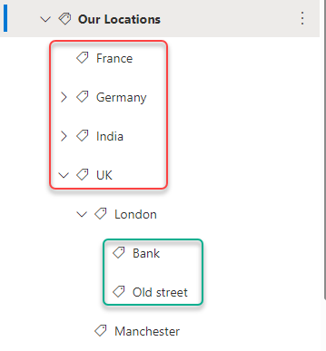
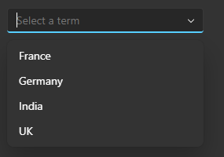
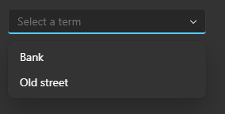
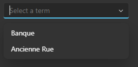

# mgt-taxonomy-picker

## Overview
The taxonomy picker is a component that can query the [Microsoft Graph API for Taxonomy](https://learn.microsoft.com/graph/api/resources/termstore-term?view=graph-rest-1.0) and render a dropdown control with terms, allowing selection of **a single** term based on the specified term set `id` or a combination of the specified term set `id` and the specified term `id`. 

The component retrieves the first level terms that are present under a specified term set or term. If only the term set id is provided, it returns the first level terms under that term set. If both the term set id and term id are provided, it returns the first level terms under the specified term.

> **Note**
> This capability currently supports a **single** selection of terms coming from the term store. This will be reviewed in the future.  

## User Scenarios

Let's assume a term store with the following structure:

### Scenario 1 - Select a term from a term set

Shows the terms marked with a red box in the image above.

### Scenario 2 - Select a term from a term in a term set

Shows the terms marked with a green box in the image above.

### Scenario 3 - Select a term from a term in a term set in a different language

Shows French labels of the terms marked with a green box in the image above.

## Proposed Solution

### Examples

#### Show the first level children of the term set with the specified id.

`<mgt-taxonomy-picker term-set-id="138a652e-7f23-46f6-b480-13da2308c235"></mgt-taxonomy-picker>`

#### Show the first level children of the term with the specified id under the term set with the specified id.

`<mgt-taxonomy-picker term-set-id="138a652e-7f23-46f6-b480-13da2308c235" term-id="a56caeb7-3b7d-4d22-93a9-0232e12905f6"></mgt-taxonomy-picker>`

#### Show the first level children of the term with the specified id under the term set with the specified id in a different language.

`<mgt-taxonomy-picker term-set-id="138a652e-7f23-46f6-b480-13da2308c235" term-id="a56caeb7-3b7d-4d22-93a9-0232e12905f6" locale="fr-FR"></mgt-taxonomy-picker>`

#### Cache the response from the API call for 50 seconds.

`<mgt-taxonomy-picker term-set-id="138a652e-7f23-46f6-b480-13da2308c235" cache-enabled="true" cache-invalidation-period="50000"></mgt-taxonomy-picker>`

## Properties and Attributes

| Attribute | Property | Description | Type |
| - | - | - | - |
| placeholder | placeholder | Optional. The placeholder to use in the combobox. Default value is `Select a term`. | string |
| term-set-id | termsetId | Mandatory. The ID of the term set to retrieve first level terms from. | string |
| term-id | termId | Optional. The ID of the term to retrieve first level terms from. If not provided, the function retrieves the first level terms under the term set specified by `term-set-id`.   *Note* that this term must be one of the terms under the term set with ID `term-set-id`. | Number |
| locale | locale | Optional. The locale of the terms that need to be displayed. This will be useful only when terms have multiple labels in different languages. | String |
| default-selected-term-id | defaultSelectedTermId | Optional. The id of the term that should be selected by default. | String |
| site-id | siteId | Optional. The id of the site where the term set is present. If not specified, the term set is assumed to be at the tenant level. | String |
| position | position | Optional. The position of the dropdown. Can be 'above' or 'below'. Default is `below` | String |
| version | version | Optional. API version to use when making the GET request. Default is `beta`. | String |
| cache-enabled | cacheEnabled | Optional. When set, it indicates that the response from the resource will be cached. Default is `false`.| Boolean |
| cache-invalidation-period | cacheInvalidationPeriod | Optional. (Number of milliseconds) When set in combination with `cacheEnabled`, the delay before the cache reaches its invalidation period will be modified by this value. Default is `0` and will use the default invalidation period. | Number |

## Events

| Event | When is it fired | Custom data |
| - | - | - |
| selectionChanged | Fired when the user makes a change in selection | The selected term which will of the type `TermStore.Term` |

## Templates

| Data type | Data Context | Description |
| - | - | - |
| default | null: no data | The template used to override the rendering of the entire component. |
| loading | null: no data | The template used to render the state of the picker while the request to Graph is being made. |
| error | error | The template used there is an error.| 
| no-data | no data | The template used if no terms are present. |

## APIs and Permissions

Permissions required by this component are `TermStore.Read.All`.